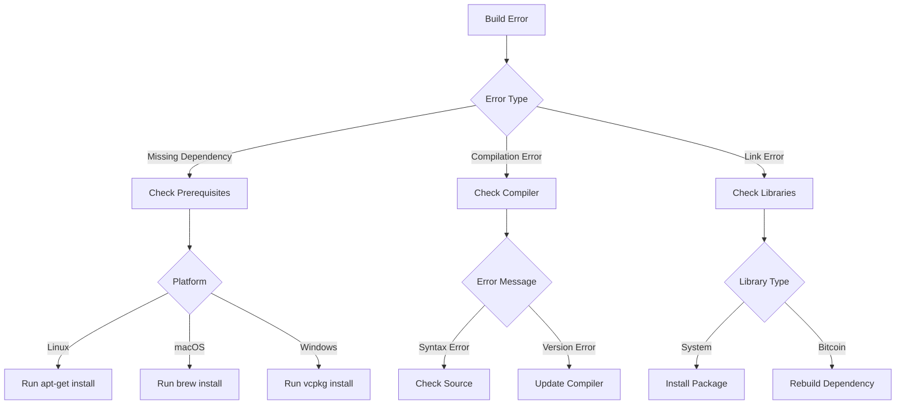

# Setting Up Your Bitcoin Core Development Environment

## 🎯 Environment Setup Guide

### Platform-Specific Prerequisites

#### Linux (Ubuntu/Debian)
```bash
# Essential build tools
sudo apt-get update
sudo apt-get install build-essential libtool autotools-dev automake pkg-config bsdmainutils python3

# Bitcoin Core dependencies
sudo apt-get install libevent-dev libboost-dev libboost-system-dev libboost-filesystem-dev libboost-test-dev libsqlite3-dev

# Optional: GUI dependencies
sudo apt-get install libqt5gui5 libqt5core5a libqt5dbus5 qttools5-dev qttools5-dev-tools
```

#### macOS
```bash
# Install Homebrew if not present
/bin/bash -c "$(curl -fsSL https://raw.githubusercontent.com/Homebrew/install/master/install.sh)"

# Install dependencies
brew install automake berkeley-db4 libtool boost miniupnpc openssl pkg-config python qt libevent qrencode

# Special note for M1/M2 Macs
export LDFLAGS="-L/opt/homebrew/lib"
export CPPFLAGS="-I/opt/homebrew/include"
```

#### Windows
```powershell
# Using vcpkg (recommended)
git clone https://github.com/Microsoft/vcpkg.git
cd vcpkg
./bootstrap-vcpkg.bat
./vcpkg integrate install

# Install dependencies
vcpkg install boost:x64-windows-static
vcpkg install libevent:x64-windows-static
vcpkg install berkeley-db:x64-windows-static
```

### 🔧 Building Bitcoin Core

#### 1. Clone the Repository
```bash
git clone https://github.com/bitcoin/bitcoin.git
cd bitcoin
```

#### 2. Select Build Configuration
```bash
# Generate build system
./autogen.sh

# Configure build
./configure --with-gui=no  # CLI only
# OR
./configure  # With GUI
```

#### 3. Compile
```bash
# Standard build
make -j$(nproc)  # Linux/macOS
make -j%NUMBER_OF_PROCESSORS%  # Windows

# Debug build
make -j$(nproc) debug
```

## 🔍 Validation Steps

### 1. Basic Functionality Check
```bash
# Test binary
src/bitcoind -version
src/bitcoin-cli -version

# Start daemon in regtest mode
src/bitcoind -regtest -daemon

# Basic CLI test
src/bitcoin-cli -regtest getblockchaininfo
```

### 2. Build Verification
```bash
# Run test suite
make check

# Run extended tests
make check-extended
```

### 3. Environment Validation Script
```python
#!/usr/bin/env python3

import subprocess
import sys
import os

def check_dependency(name, command):
    try:
        subprocess.run(command, shell=True, check=True, capture_output=True)
        print(f"✅ {name} installed correctly")
        return True
    except subprocess.CalledProcessError:
        print(f"❌ {name} not found or incorrectly installed")
        return False

def main():
    dependencies = {
        "Git": "git --version",
        "Make": "make --version",
        "GCC/G++": "g++ --version",
        "Python3": "python3 --version",
        "Berkeley DB": "test -f /usr/local/BerkeleyDB.4.8/include/db_cxx.h || test -f /usr/include/db_cxx.h",
        "Boost": "ldconfig -p | grep boost || brew list | grep boost",
        "OpenSSL": "openssl version",
    }

    all_passed = True
    for dep, cmd in dependencies.items():
        if not check_dependency(dep, cmd):
            all_passed = False

    if all_passed:
        print("\n✨ All dependencies are correctly installed!")
    else:
        print("\n⚠️ Some dependencies are missing or incorrectly installed")
        sys.exit(1)

if __name__ == "__main__":
    main()
```

## 🌳 Troubleshooting Decision Tree

### Build Failures


### Common Issues and Solutions

#### 1. Berkeley DB Issues
```bash
# Error: db_cxx.h not found
# Solution:
cd contrib/install_db4.sh
./install_db4.sh `pwd`
```

#### 2. Boost Errors
```bash
# Error: Boost headers not found
# Solution for Linux:
sudo apt-get install libboost-all-dev

# Solution for macOS:
brew install boost
```

#### 3. Memory Errors During Build
```bash
# Error: Virtual memory exhausted
# Solution:
make -j2  # Reduce parallel jobs
```

#### 4. Qt/GUI Issues
```bash
# Error: Qt headers missing
# Solution for Linux:
sudo apt-get install qt5-default

# Solution for macOS:
brew install qt5
```

## 🔄 Update and Maintenance

### 1. Keeping Dependencies Updated
```bash
# Linux
sudo apt-get update && sudo apt-get upgrade

# macOS
brew update && brew upgrade

# Windows
vcpkg upgrade
```

### 2. Cleaning Build
```bash
make clean
make distclean  # Deeper clean
git clean -xfd  # Complete reset
```

### 3. Updating Bitcoin Core
```bash
git fetch origin
git checkout master
git pull origin master
./autogen.sh
./configure
make
```

## 📊 Environment Health Check

### 1. System Resources
```bash
# Check available memory
free -h

# Check disk space
df -h

# Check CPU
nproc
```

### 2. Network Configuration
```bash
# Test P2P ports
nc -zv localhost 8333

# Test RPC ports
nc -zv localhost 8332
```

### 3. Performance Optimization
```bash
# Recommended make flags
MAKEFLAGS="-j$(nproc)"

# ccache configuration
export CC="ccache gcc"
export CXX="ccache g++"
```

## 🎯 Next Steps

1. Set up your IDE/editor with appropriate plugins
2. Configure Git hooks for pre-commit checks
3. Join the Bitcoin Core development channels
4. Review the coding guidelines

Remember: A properly configured development environment is crucial for efficient Bitcoin Core development. Take time to validate each component and understand the build process.
